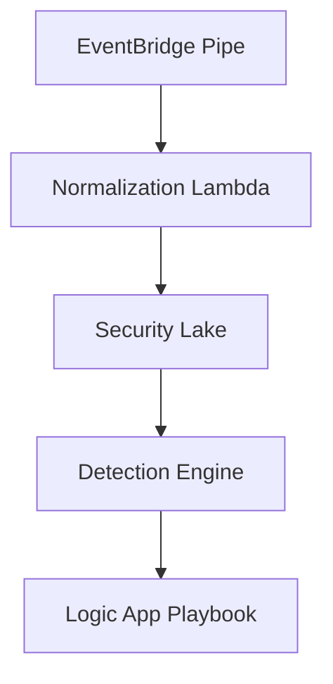

+++
title = "Cloud SOC Automation Runbook"
date = 2024-05-12T06:45:00Z
summary = "Serverless workflows that normalize cloud telemetry and trigger containment in minutes."
description = "Step-by-step cloud SOC automation runbook covering log ingestion, normalization, and containment with AWS and Azure services."
tags = ["Cloud", "Automation", "SIEM"]
categories = ["Engineering"]
cover = "cover.svg"
authors = ["Alief Kurniawan"]
featured = true
+++

Cloud control planes push thousands of events every minute. To keep the SOC ahead I rely on this automation runbook:

1. **Normalize telemetry** with AWS EventBridge Pipes and Azure Event Grid filters. Every event lands in a shared schema before the SIEM ingests it.
2. **Enrich alerts** through Lambda/Functions that call threat intel APIs and append GeoIP attributes.
3. **Trigger containment** using Systems Manager Automation or Azure Logic Apps depending on the account owner.


Keep an "off" switch by tagging every automation with `rollback=true` and maintaining a manual execution guide.


For observability I emit metrics to CloudWatch and Azure Monitor, then expose them on a shared Grafana board for the on-call rotation.
