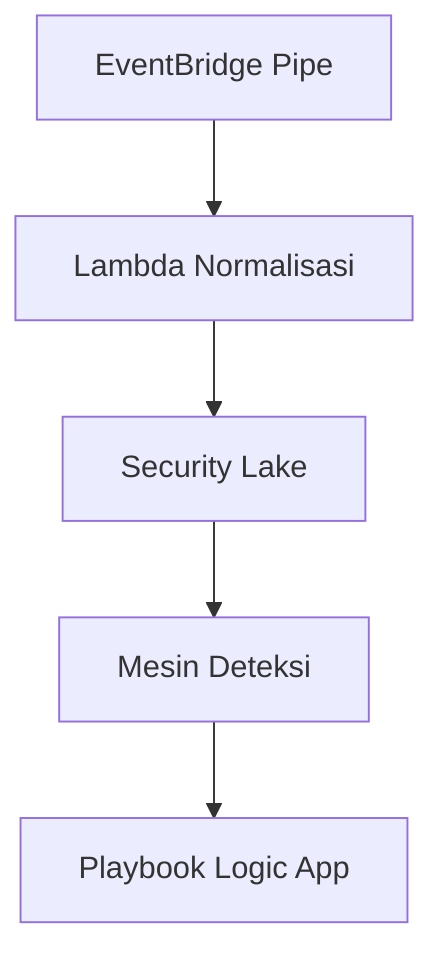

+++
title = "Runbook Otomasi SOC Cloud"
date = 2024-05-12T13:45:00+07:00
summary = "Workflow serverless untuk menormalkan telemetri cloud dan memicu containment dalam hitungan menit."
description = "Runbook otomasi SOC cloud berbahasa Indonesia yang membahas ingestion log, normalisasi, dan containment memakai layanan AWS dan Azure."
tags = ["Cloud", "Automation", "SIEM"]
categories = ["Engineering"]
cover = "cover.svg"
authors = ["Alief Kurniawan"]
featured = true
+++

Kontrol plane cloud mengirim ribuan event tiap menit. Agar SOC tetap siap, aku mengikuti runbook otomasi berikut:

1. **Normalisasi telemetri** dengan AWS EventBridge Pipes dan filter Azure Event Grid. Semua event dipetakan ke skema bersama sebelum masuk SIEM.
2. **Perkaya alert** melalui Lambda/Functions yang memanggil API intelijen ancaman dan menambahkan atribut GeoIP.
3. **Picu containment** memakai Systems Manager Automation atau Azure Logic Apps sesuai pemilik akun.


Sediakan tombol darurat dengan menandai setiap otomasi memakai `rollback=true` dan simpan panduan eksekusi manual.


Untuk observabilitas, metrik kukirim ke CloudWatch dan Azure Monitor lalu kutampilkan di Grafana yang sama untuk tim _on-call_.
